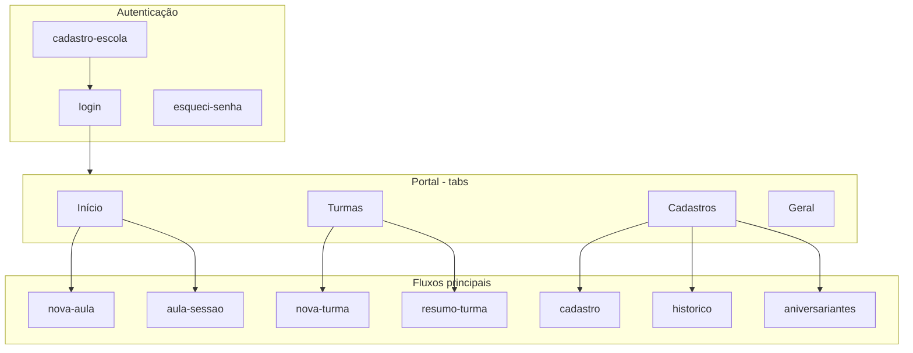
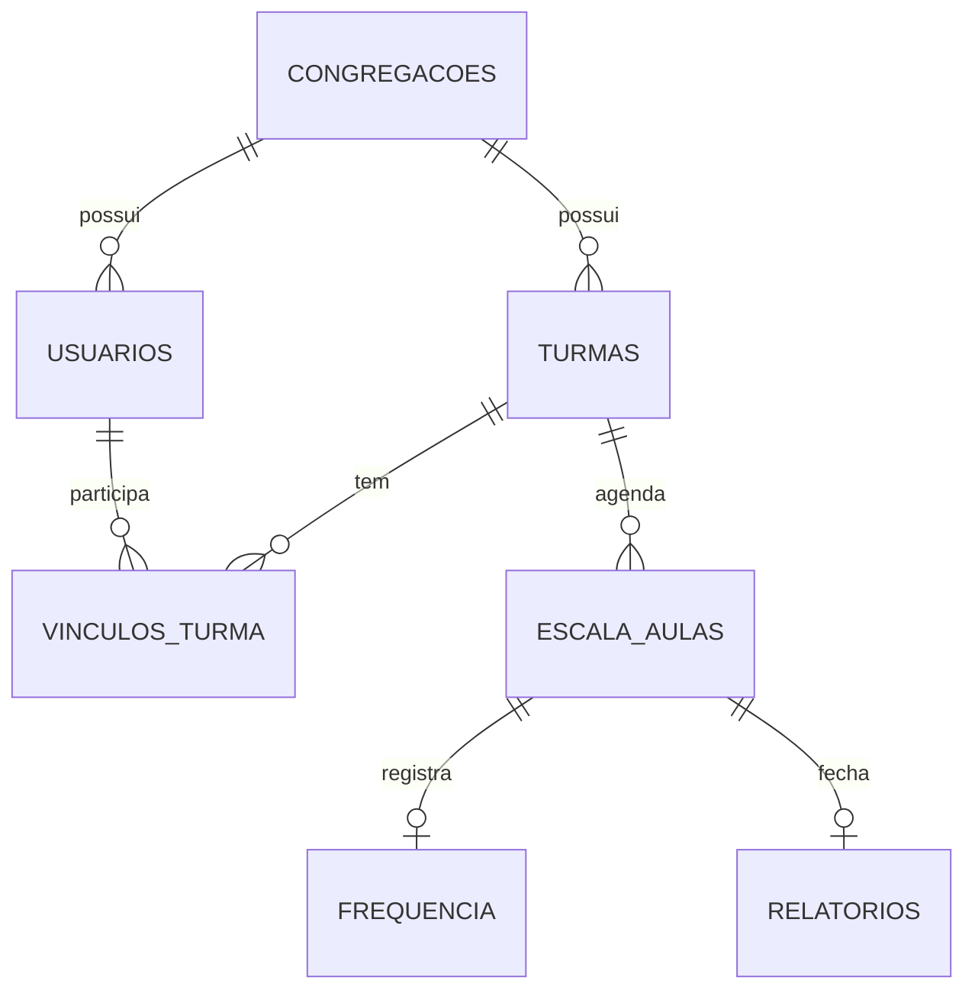
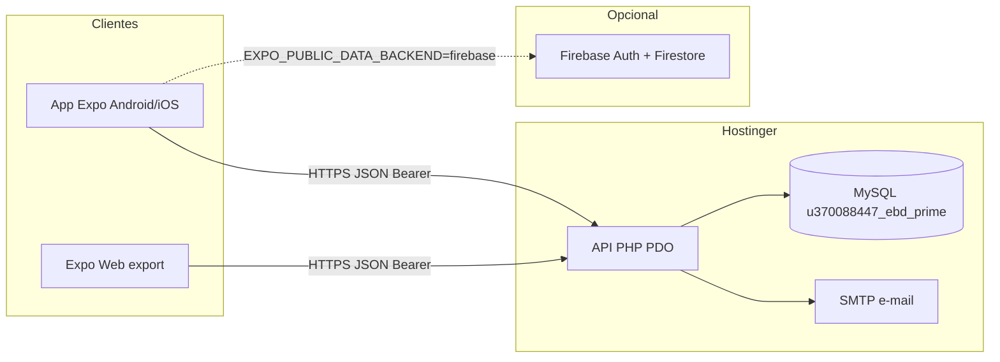

# INSTITUTO FEDERAL DE EDUCAÇÃO, CIÊNCIA E TECNOLOGIA DO TOCANTINS  
# CAMPUS PARAÍSO DO TOCANTINS  
# CURSO DE BACHARELADO EM SISTEMAS DE INFORMAÇÃO

---

# DOCUMENTO DE ESPECIFICAÇÃO: EBD PRIME

| Campo | Valor |
|--------|--------|
| **Disciplina** | [Nome da Disciplina] |
| **Professor** | [Nome do Professor] |
| **Equipe de desenvolvimento** | [Nome do Aluno 1] · [Nome do Aluno 2] · … |
| **Versão do documento** | 2.1 |
| **Repositório** | `EBD Prime` (`mobile/` + `backend/` + `docs/`) |
| **Produção (API)** | https://ebd.adparaiso.com.br |

> **Como usar este documento:** é a especificação oficial do projeto. Detalhes técnicos profundos (endpoints, migrações SQL, deploy passo a passo) estão nos anexos listados na [secção 11](#11-documentação-complementar).

---

## 1. HISTÓRICO DE ALTERAÇÕES

| Data | Versão | Descrição da alteração | Autor |
|------|--------|------------------------|--------|
| [data inicial] | 1.0 | Levantamento de requisitos e visão do produto (legado em `documentacao_ebd_prime.md`). | Equipe EBD Prime |
| 19/05/2026 | 1.1 | Consolidação em `requisitos_ebd_prime.txt` e versão pública. | Equipe EBD Prime |
| 19/05/2026 | 2.0 | Reorganização da documentação no modelo IFTO; multi-igreja numa base; produção Hostinger REST. | Equipe EBD Prime |
| 19/05/2026 | 2.1 | SMTP/recuperação de senha; inativos; turmas REST; escala; sessão por data; UI. Detalhe em `CHANGELOG.md`. | Equipe EBD Prime |

---

## 2. DEFINIÇÃO DO PROJETO

### 2.1 Tema

**Gestão digital da Escola Bíblica Dominical (EBD)** para igrejas e congregações: organização de turmas, pessoas (alunos e professores), escala de aulas, chamada (frequência), materiais pedagógicos (Bíblia, revista), visitantes, oferta da aula, relatórios e painéis de acompanhamento para a liderança.

O sistema opera no nicho **religioso / educação dominical**, com suporte a **várias igrejas (tenants)** na mesma base de dados, isoladas por `congregacao_id`.

### 2.2 Objetivo do aplicativo

| Aspecto | Descrição |
|---------|-----------|
| **Problema** | Registos em papel ou planilhas dispersas; dificuldade em fechar relatórios no mesmo dia; pouca visibilidade de assiduidade, rankings e aniversariantes. |
| **Público-alvo** | Administradores da escola, professores, secretários/coordenadores; alunos com login quando aplicável. |
| **Valor entregue** | Um único app (Android/iOS/Web) para cadastrar a escola, gerir turmas e pessoas, lançar a aula em poucos toques e consultar resumos e histórico. |
| **Resultado esperado** | Menos tempo na chamada; dados centralizados; relatório da turma e visão “Geral” após as aulas serem registadas. |

### 2.3 Stakeholders e perfis

| Perfil | Responsabilidade no sistema |
|--------|------------------------------|
| Administrador da igreja | Onboarding da escola, turmas, cadastros, convites de admin, configurações. |
| Professor | Escala (quando permitido), sessão de aula, frequência e relatório das suas turmas. |
| Aluno (com login) | Consulta limitada conforme `nivel_acesso`. |
| Operador da plataforma | Conta sem `congregacao_id` (uso interno; não é o admin local da igreja). |
| Equipe técnica | Deploy, base de dados, SMTP, variáveis de ambiente. |

---

## 3. REQUISITOS DO SISTEMA

### 3.1 Requisitos funcionais (RF)

Descrevem **ações** que o sistema deve executar. A numeração canónica **RF001–RF050** está detalhada em `docs/requisitos_ebd_prime.txt` (com estado `[IMPL]`, `[PARCIAL]`, `[MOCK]`, `[FUTURO]`). Resumo por módulo:

| ID (faixa) | Módulo | Descrição resumida | Estado geral |
|------------|--------|-------------------|--------------|
| RF001–RF006 | Autenticação | Login, logout, token, recuperação de senha por e-mail (REST Hostinger + SMTP). | Implementado |
| RF007–RF009 | Onboarding | Cadastro de nova igreja/escola (SMS, registo, primeiro admin). | Implementado (SMS real depende de config.) |
| RF010–RF012 | Navegação | Tabs Início/Geral, drawer, rotas do app. | Implementado |
| RF013–RF017 | Início | Saudação dinâmica, checklist, escala, tutoriais (vídeos mock). | Implementado / mock vídeos |
| RF018–RF020 | Turmas | Listar, criar, editar, remover, departamento. | Implementado (REST) |
| RF021–RF024 | Cadastros | CRUD pessoas, inativos (incl. lote), ativar, convite admin. | Implementado (REST) |
| RF025–RF027 | Aulas | Nova aula, sessão (chamada, oferta, relatório), gate do Geral. | Implementado |
| RF028–RF029 | Resumo turma | Rankings por intervalo. | Implementado (mock se sem API) |
| RF030–RF031 | Histórico / aniversários | Timeline do aluno; lista do mês. | Implementado |
| RF032–RF034 | Geral | Dashboard após primeira aula; rankings ainda com dados de exemplo. | Parcial / mock |
| RF035–RF039 | Configurações / UI | Partilhar, termos, tema, teclado adaptativo. | Implementado / “Em breve” em itens |
| RF040–RF050 | Backlog funcional | Push, PDF, tesouraria, web dedicada, JWT, testes, i18n. | Futuro |

**Exemplos (formato do modelo académico):**

- **RF001:** O sistema deve permitir autenticação com utilizador e palavra-passe, com indicação de estado do servidor.
- **RF022:** O administrador deve cadastrar e editar alunos e professores, vinculando turma e papéis.
- **RF026:** O professor deve registar presença, Bíblia, revista, visitantes, oferta e observações na sessão de aula.
- **RF041:** O painel Geral deve consumir endpoint agregado real (substituir dados de exemplo).

Versão em linguagem não técnica: `docs/requisitos_ebd_prime_publico.txt`.

### 3.2 Requisitos não funcionais (RNF)

Características de **qualidade**, desempenho e restrições:

| ID | Requisito | Estado |
|----|-----------|--------|
| **RNF001** | App em React Native (Expo) + TypeScript; Expo Router; build Android/iOS. | Implementado |
| **RNF002** | Backend centralizado: API PHP (PDO) **ou** Firebase; cliente unificado em `mobile/lib/api.ts`. | Implementado |
| **RNF003** | Base MySQL (produção Hostinger) ou Firestore; sem sincronização automática entre motores. | Implementado |
| **RNF004** | Deploy em subdomínio profissional (`ebd.adparaiso.com.br`) com variáveis `EXPO_PUBLIC_*`. | Implementado |
| **RNF005** | Interface de chamada rápida (listas com limites, operações por turma). | Implementado |
| **RNF006** | HTTPS / SSL no alojamento e domínios autorizados. | Implementado (Hostinger) |
| **RNF007** | Escalabilidade multi-igreja: tenant por `congregacao_id`; índice de login por igreja. | Implementado |
| **RNF008** | UX com teclado: ecrãs de login, recuperação, cadastros adaptam layout. | Implementado |
| **RNF009** | Analytics web opcional (Firebase Analytics). | Opcional |

### 3.3 Modelagem (telas e fluxos)

Modelagem **funcional** das principais telas (implementadas em `mobile/app/`). Wireframes visuais podem ser anexados pela equipe (Figma) nesta secção.

#### 3.3.1 Mapa de navegação (alto nível)



#### 3.3.2 Inventário de ecrãs

| Ecrã | Rota / ficheiro | Função |
|------|-----------------|--------|
| Login | `app/login.tsx` | Entrada no sistema |
| Esqueci senha | `app/esqueci-senha/` | Recuperação por e-mail |
| Cadastro escola | `app/cadastro-escola/` | Onboarding nova igreja |
| Início | `(tabs)` / `InicioPage` | Saudação, checklist, escala |
| Turmas | `TurmasPage` | Lista e gestão de turmas |
| Cadastros | `CadastrosPage` | Lista de pessoas |
| Geral | `GeralRelatorioDashboard` | Painel consolidado |
| Nova turma | `nova-turma.tsx` | Criação de turma |
| Cadastro pessoa | `cadastro.tsx` | Criar/editar utilizador |
| Cadastros inativos | `cadastros-inativos.tsx` | Lixeira / reativação |
| Nova aula | `nova-aula.tsx` | Inserir na escala |
| Sessão de aula | `aula-sessao.tsx` | Chamada e relatório |
| Resumo turma | `resumo-turma.tsx` | Rankings por período |
| Histórico | `historico.tsx` | Timeline do aluno |
| Aniversariantes | `aniversariantes.tsx` | Lista do mês |
| Configurações | `configuracoes.tsx` | Conta, termos, sair |
| Acesso administrativo | `acesso-administrativo/` | Admins e convites |

#### 3.3.3 Modelo de dados (conceitual)



Detalhe físico: `backend/database.sql` e migrações `backend/database_migration_*.sql`.

---

## 4. REQUISITOS TÉCNICOS DO PROJETO

| Item | Tecnologia / ferramenta |
|------|------------------------|
| **Linguagem (cliente)** | TypeScript |
| **Linguagem (servidor)** | PHP 8.x |
| **Framework / plataforma** | Expo (React Native), Expo Router |
| **Banco de dados** | MySQL 8 (`u370088447_ebd_prime` na Hostinger) |
| **Legado (opcional)** | Firebase Authentication + Firestore |
| **Controle de versão** | Git |
| **API** | REST JSON (`backend/api/`), referência OpenAPI `backend/openapi.yaml` |
| **Alojamento** | Hostinger — API em `ebd.adparaiso.com.br` |
| **E-mail** | SMTP Hostinger (`EBD_SMTP_*`) para recuperação de senha |
| **Serviços de terceiros** | Expo (build/OTA), Firebase (modo legado), WhatsApp (link de apoio na UI) |
| **Ambiente local** | Docker Compose (MySQL), `php -S` porta 8080 (`npm run api`) |

### 4.1 Estrutura do repositório

```
EBD Prime/
├── mobile/              App Expo (TypeScript)
├── backend/             API PHP, SQL, scripts, .env
├── docs/                Documentação (este documento e anexos)
├── firestore.rules      Regras Firebase (legado)
├── scripts/             Migração Firestore → MySQL (opcional)
└── package.json         Comandos npm (db, api, migrate)
```

### 4.2 Variáveis de ambiente principais

| Variável | Onde | Função |
|----------|------|--------|
| `EXPO_PUBLIC_DATA_BACKEND` | `mobile/.env` | `rest` ou `firebase` |
| `EXPO_PUBLIC_API_URL` | `mobile/.env` | URL da API (ex.: `https://ebd.adparaiso.com.br`) |
| `EBD_DB_*` | `backend/.env` | Ligação MySQL |
| `EBD_SMTP_*` | `backend/.env` | Envio de e-mails |
| `EBD_CORS_ORIGIN` | `backend/.env` | CORS em produção |

Modelos: `backend/.env.example`, `mobile/.env.example`, `backend/.env.hostinger.example`.

---

## 5. IDEIAS FUTURAS (BACKLOG)

Funcionalidades planejadas para versões posteriores (V2, V3):

| Prioridade | Item |
|------------|------|
| Alta | Endpoint agregado do painel **Geral** (substituir mocks RF034). |
| Alta | Regra “todas as turmas enviaram” para fechar ranking do dia (RN005 completo). |
| Média | Notificações push (avisos administrativos). |
| Média | Exportação de relatórios em **PDF** e partilha. |
| Média | Módulo de **tesouraria** completo (além da oferta por aula). |
| Média | Site web publicado na raiz do domínio (Expo export — ver deploy web). |
| Baixa | Modo escuro (Dark Mode). |
| Baixa | Gamificação ampliada (badges, metas por trimestre). |
| Baixa | Painel web da plataforma (listar igrejas / operador). |
| Baixa | Subdomínio por igreja (`igreja-x.ebd...`) resolvendo tenant por host. |
| Baixa | Testes automatizados (Jest / Detox). |
| Baixa | Internacionalização (i18n). |

Lista operacional atualizada: `docs/ESTADO_DO_PROJETO.md` (secção 3).

---

## 6. REGRAS DE NEGÓCIO (RN)

| ID | Regra | Estado |
|----|-------|--------|
| **RN001** | Interface sem divisão obrigatória por trimestre no acompanhamento; progresso fluido / timeline. | Implementado |
| **RN002** | Mesma lógica de negócio no cliente via `api.ts` (REST ou Firebase). | Implementado |
| **RN003** | Ranking: presença + materiais no período; Geral ainda parcialmente mock. | Parcial |
| **RN004** | Visibilidade: professor vê/edita suas turmas; admin vê a **sua** igreja (`congregacao_id` do token). | Parcial |
| **RN005** | Relatório consolidado só quando todas as turmas enviarem — hoje gate = primeiro relatório. | Parcial |
| **RN006** | Vencedores por departamento com troféu no Geral. | Mock |
| **RN007** | Utilizador professor+aluno com conflito de horário / presença justificada. | Futuro |

**Multi-igreja:** cada igreja é uma linha em `congregacoes`; a API **nunca** mistura dados entre tenants. Ver `docs/MULTI_IGREJA_UMA_BASE.md`.

---

## 7. ARQUITETURA DO SISTEMA



| Camada | Responsabilidade |
|--------|------------------|
| **Apresentação** | `mobile/app`, componentes, contexto `AuthContext` |
| **Aplicação (cliente)** | `mobile/lib/api.ts` — escolhe REST ou Firebase |
| **API** | `backend/api/**/*.php`, autenticação `bearer.php` |
| **Dados** | MySQL, migrações versionadas, scripts em `backend/scripts/` |

---

## 8. AMBIENTES, DEPLOY E OPERAÇÕES

| Ambiente | Base de dados | API | App |
|----------|---------------|-----|-----|
| **Local** | Docker MySQL (`npm run db:up`) | `npm run api` → `:8080` | `npx expo start` |
| **Produção** | Hostinger MySQL | `https://ebd.adparaiso.com.br` | `.env` com `EXPO_PUBLIC_API_URL` |

| Tarefa | Documento |
|--------|-----------|
| Publicar API (FTP) | `docs/DEPLOY-HOSTINGER-AGORA.md` |
| Publicar site web | `docs/DEPLOY-WEB-HOSTINGER.md` |
| Migração Firebase → MySQL | `docs/migracao-hostinger.md` |
| Estado e prioridades | `docs/ESTADO_DO_PROJETO.md` |

**Comandos úteis:** `npm run db:seed:demo`, `php backend/scripts/prepare-hostinger-deploy.php`, `php backend/scripts/apply-migration-009-multi-igreja.php`.

---

## 9. SEGURANÇA E PRIVACIDADE

| Prática | Descrição |
|---------|-----------|
| Credenciais | Nunca commitar `backend/.env` ou `mobile/.env`. |
| HTTPS | Obrigatório em produção para login e tokens. |
| SQL | PDO com prepared statements (anti SQL injection). |
| Multi-tenant | Escopo por `ebd_resolve_congregacao_scope()` após login. |
| Senhas | Hash no servidor; recuperação por token temporário + e-mail. |
| Firestore (legado) | Endurecer leitura pública de `usuarios` em produção (ver `AUDITORIA-FIREBASE.md`). |

---

## 10. MIGRAÇÕES DE BASE DE DADOS

| Ficheiro | Descrição |
|----------|-----------|
| `backend/database.sql` | Schema inicial |
| `database_migration_004` … `006` | Subtítulo, onboarding, recuperação senhas |
| `database_migration_009_multi_igreja_login.sql` | Login único por igreja (`congregacao_id` + `login_usuario`) |
| `database_migration_009_inativos_sem_turma_smtp.sql` | Inativos sem turma; SMTP por congregação; link reset |
| `database_migration_008_escola_unica.sql` | **Não usar** se mantiver várias igrejas |

Ordem: aplicar no phpMyAdmin ou via scripts documentados em `migracao-hostinger.md`.

---

## 11. DOCUMENTAÇÃO COMPLEMENTAR

| Documento | Conteúdo | Público |
|-----------|----------|---------|
| **Este ficheiro** | Especificação completa (modelo IFTO) | Académico / equipe |
| `docs/README.md` | Índice da pasta `docs/` | Todos |
| `docs/ESTADO_DO_PROJETO.md` | O que funciona / o que falta | Desenvolvimento |
| `docs/CHANGELOG.md` | Histórico datado de releases e correções | Todos |
| `docs/requisitos_ebd_prime.txt` | RF/RNF/RN com rastreio ao código | Programadores |
| `docs/requisitos_ebd_prime_publico.txt` | Mesmos requisitos, linguagem simples | Professor / avaliador |
| `docs/api_rest_ebd_prime.md` | Endpoints REST | Backend |
| `docs/MULTI_IGREJA_UMA_BASE.md` | Arquitetura multi-tenant | Backend |
| `docs/AUDITORIA-FIREBASE.md` | Firebase vs REST | Migração |
| `docs/DEPLOY-HOSTINGER-AGORA.md` | Deploy API | DevOps |
| `docs/DEPLOY-WEB-HOSTINGER.md` | Deploy site | DevOps |
| `docs/migracao-hostinger.md` | MySQL remoto, import, SMTP | DevOps |
| `docs/documentacao_ebd_prime.md` | Histórico legado (RF01 antigos) | Referência |

---

## 12. GLOSSÁRIO

| Termo | Significado |
|-------|-------------|
| **EBD** | Escola Bíblica Dominical |
| **Congregação / igreja** | Tenant (`congregacao_id`); unidade organizacional |
| **Turma / classe** | Grupo de alunos (ex.: Jovens, Adolescentes) |
| **Escala** | Calendário de aulas e professores por data |
| **Sessão de aula** | Ecrã de chamada + relatório do dia |
| **Geral** | Painel consolidado da escola |
| **REST** | Backend PHP + MySQL (produção actual) |
| **Tenant** | Isolamento de dados por igreja na mesma base |

---

*Documento mantido pela equipe EBD Prime. Para alterações, actualizar a tabela da secção 1 e os anexos técnicos quando o código mudar.*
